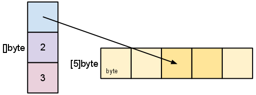

# Slice

https://go.dev/blog/slices-intro

Slice is a 'pointer' to the data

Slice:
- Pointer
- len(gth)
    - Accessed through `len(slc)`
- cap(acity)
    - Accessed through `cap(slc)`
        - see: `s = s[:cap(s)]`

`append`, `copy` can expand the cap/data region.
