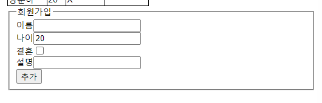

- MySQL
- MongoDB
  - -> 'NoSQL'
  - on 다음장

---

- **DMBS**
  - Relational DMBS (RDMBS)

---

# Mysql

!: **SCHEMA** = DATABASE

```sql
CREATE TABLE nodejs.users (
    id INT NOT NULL AUTO_INCREMENT,
    name VARCHAR(20) NOT NULL,
    age INT UNSIGNED NOT NULL,
    married TINYINT NOT NULL,
    comment TEXT NULL,
    created_at DATETIME NOT NULL DEFAULT now(),
    PRIMARY KEY(ID),
    UNIQUE INDEX name_UNIQUE (name ASC))
    COMMENT = '사용자 정보'
    DEFAULT CHARSET=utf8
    ENGINE=InnoDB;
```

- AUTO_INCREMENT
- TINYINT
  - `-127~128`
  - **Boolean** 값으로 활용 가능
- DATETIME ... **DEFAULT now()**
  - 기본값을 현재 시각으로 설정
- PRIMARY KEY(ID)
- UNIQUE INDEX name_UNIQUE (name ASC)
  - `UNIQUE INDEX <name> (<col> ASC)`
  - 값이 고유하도록 제한
  - *조회를 더 빠르게 함*
- COMMENT = '사용자 정보'
- CHARSET=utf8
  - *한글 사용 시 필수!!*
- ENGINE=InnoDB

!: `DESC table`

- **!:** `CONSTRAINT <name> FOREIGN KEY <col> REFERENCES <foreigncol> ...`
  - **!:** `... ON DELETE CASCADE ON UPDATE CASCADE`
    - = 참조된 외래키 변경/삭제 시 따라 변경/삭제

!: `SHOW TABLES/DATABASES`

## SQL 명령어

!: `SELECT ... LIMIT <n> OFFSET <n>`

멋지네요

---

# Sequelize

- **ORM**
  - [관련 Tistory](https://jalynne-kim.medium.com/데이터베이스-백엔드-orm-object-relational-mapping-의-개념과-종류-활용방안-c43b69028957)
    - 다른 언어의 객체를 SQL과 연결시켜주는 도구

```
npm i sequelize mysql2
npm i -g sequelize-cli
```

```js title="models/index.js"
'use strict';

const fs = require('fs');
const path = require('path');
const Sequelize = require('sequelize');
const process = require('process');
const basename = path.basename(__filename);
const env = process.env.NODE_ENV || 'development';
const config = require(__dirname + '/../config/config.json')[env];
const db = {};

const sequelize = new Sequelize(config.database, config.username, config.password, config);

db.sequelize = sequelize;
db.Sequelize = Sequelize;

module.exports = db;
```

## config.json 설정하기

```json
"development": {
    "username": "root",
    "password": "...",
    "database": "nodejs",
    "host": "127.0.0.1",
    "dialect": "mysql",
    "operatorAliases": false
},
```

## Table 모델 설정

```js
const { Sequelize, DataTypes } = require("sequelize");
// 공식 문서 참고하여 DataType를 import 해 사용
// https://sequelize.org/

module.exports = (/** @type Sequelize */ sequelize) => {
  return sequelize.define("user", {
    // !!! 'user'를 이름으로 설정 !!!
    // (sequelize가 자동으로 `users` 이름의 테이블 탐색함)
    //   (상당히 이상하네요)
    name: {
      type: DataTypes.STRING(20),
      allowNull: false,
      unique: true,
    },
    age: {
      type: DataTypes.INTEGER.UNSIGNED,
      allowNull: false,
    },
    married: {
      type: DataTypes.BOOLEAN,
      allowNull: false,
    },
    comment: {
      type: DataTypes.TEXT,
      allowNull: true,
    },
    created_at: {
      type: DataTypes.DATE,
      allowNull: false,
      defaultValue: DataTypes.NOW
    },
  }, {
    timestamps: false, // !!!: createdAt, updatedAt 칼럼 기록 X
  });
};

```

## 실전

(일단 관계 설정 전에  구현부터 해보기)
(see: [#](#관계-설정))

- html tag: **fieldset ... legend**



XMLHttpRequest =>

```js
const userDeleteButtons = document.querySelectorAll(
  ".user-table__delete-button"
);
userDeleteButtons.forEach((button) => {
  const { userId } = button.dataset;
  button.addEventListener("click", () => {
    const xhr = new XMLHttpRequest(); // 생성
    xhr.onerror(() => {               // 에러 대응 **SEE 오답 노트**
      console.error(xhr.responseText);
    });
    xhr.open("delete", `/users/${userId}`); // 실행!
  });
});
```

### ^^^ 오답 노트

onload 잘못 설정함

```js
xhr.onerror = () => {
  console.error(xhr.responseText);
};
```

send를 깜빡함

```js
xhr.open("delete", `/users/${userId}`);
xhr.send() // !!!
```

## 관계 설정

- 1:N
- 1:1 (ex: 사용자 & 사용자정보)
- N:M

```js
Foo.hasOne(Bar);
Bar.belongsTo(Foo);
```

+) https://sequelize.org/docs/v7/associations/has-many/#foreign-key-targets-sourcekey

```js
{
  foreignKey: 'postId',
  // The foreign key will reference the `id` attribute of the `Post` model
  sourceKey: 'id',
}
```

also: https://sequelize.org/docs/v7/querying/operators/
- Operator(ex: `in`) in where

# see also:

- [TypeORM](https://typeorm.io/)
- [Should I use ORM? (Reddit)](https://www.reddit.com/r/learnprogramming/comments/vbnu8k/should_i_use_an_orm/)
- [fetch() method](https://developer.mozilla.org/en-US/docs/Web/API/Fetch_API/Using_Fetch)

---

이 정도만 해보자...

?:
- XHR 모드는 옛날 방법같음. 요즘은 express & request들을 어떻게 만들까?
- POST/DELETE 메서드 실행 후 redirection은 어떻게 처리할까?
  - 서버에서? 클라이언트에서?
- 

